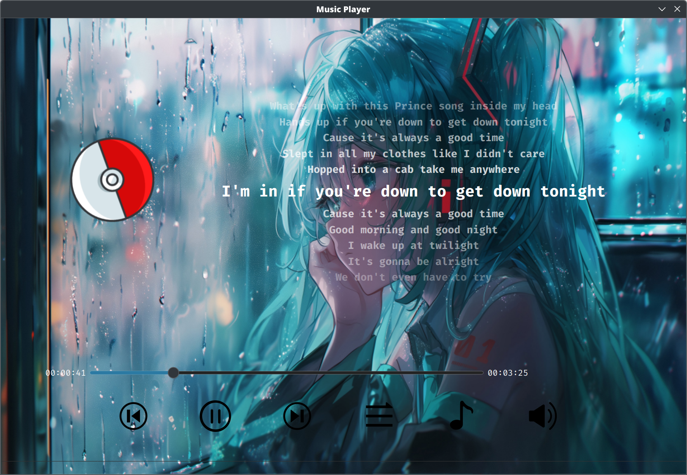
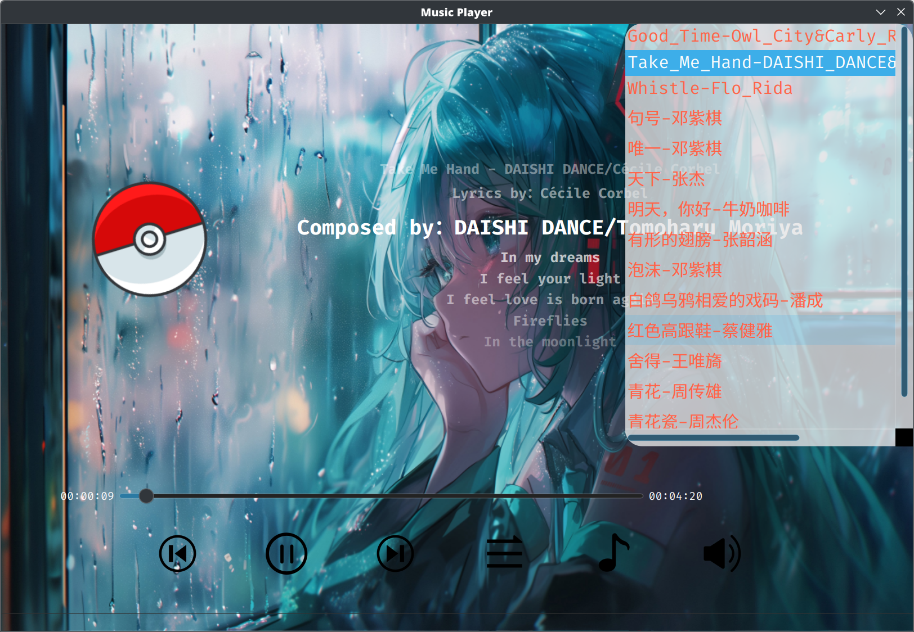

# 简易音乐播放器

## 项目简介

这是一个基于 Qt 框架开发的简易音乐播放器，作为个人学习 Qt 和 C++ 的练习项目。虽然功能不及商业软件那么完善，但尽力实现了基本的音乐播放功能和歌词显示，希望能够为用户提供简洁、易用的音乐播放体验。

## 功能特性

- 基本播放控制：播放、暂停、上一曲、下一曲
- 多种播放模式：顺序播放、单曲循环、随机播放、列表循环
- 音量调节：支持音量调节和静音功能
- 歌词同步显示：支持 .lrc 格式的歌词文件，并能够同步显示
- 播放列表管理：展示所有可播放的音乐文件
- 界面美观：简洁的用户界面，提供良好的视觉体验




## 技术栈

- 开发语言：C++
- 框架：Qt 
- 构建工具：qmake
- 音频处理：Qt Multimedia 模块
- 界面设计：Qt Designer

## 项目结构

```
MusicPlayer/
├── lyricparser.cpp/h   - 歌词解析器实现
├── mainwindow.cpp/h    - 主窗口界面实现
├── mainwindow.ui       - UI 设计文件
├── main.cpp            - 程序入口
├── MusicPlayer.pro     - 项目配置文件
├── res/                - 资源文件夹
│   ├── Audio/          - 音频文件
│   ├── Background/     - 背景图片
│   ├── Icon/           - 图标资源
│   └── Lyrics/         - 歌词文件
└── res.qrc             - 资源配置文件
```

## 编译与运行

### 环境要求

- Qt 5.15.2 或更高版本
- C++ 编译器 (如 GCC 或 MSVC)

### 编译步骤

1. 克隆或下载本项目到本地
2. 打开 Qt Creator 并加载 `MusicPlayer.pro` 文件
3. 配置项目并点击构建
4. 运行编译后的可执行文件

也可以通过命令行编译：

```bash
mkdir -p build && cd build
qmake ../MusicPlayer.pro
make
```

## 使用说明

1. 启动应用程序后，会自动加载 `res/Audio/` 目录下的音乐文件
2. 点击播放列表中的歌曲开始播放
3. 使用播放控制按钮控制音乐播放
4. 通过模式切换按钮更改播放模式
5. 歌曲播放时，如果有对应的歌词文件，会自动显示同步歌词

## 已知问题

- 暂不支持添加外部音乐文件，只能播放内置音乐
- 暂不支持搜索歌曲功能
- 某些复杂格式的 LRC 歌词可能解析不正确
- 界面尚未完全适配不同分辨率的显示器

## 未来计划

- 添加音乐文件导入功能和歌曲搜索功能
- 优化歌词解析和显示
- 增加均衡器和音效设置
- 支持更多音频格式
- 提升界面设计和用户体验


*注：这是一个个人学习项目，功能和代码质量可能还有很多不足之处，欢迎提出建议和指正。*